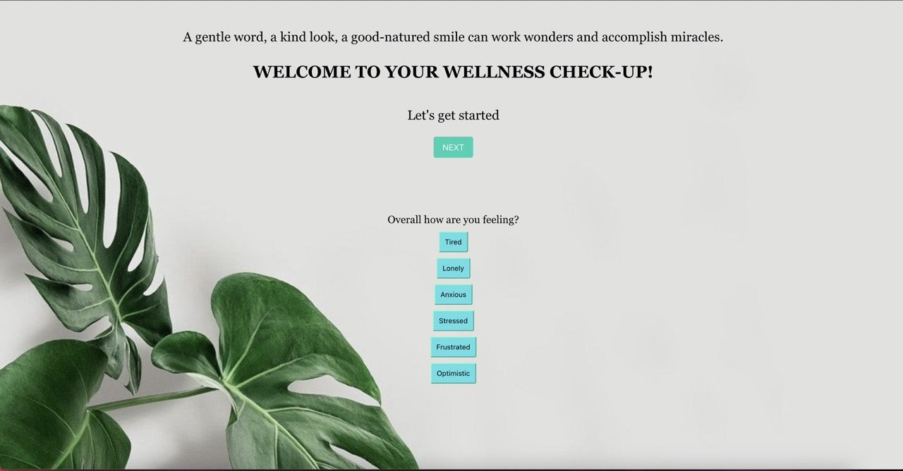

# Wellness-Checkup
URL:
https://dellmiles24.github.io/Wellness-Checkup/

## Description
The Wellness Checkup website is used to provide help for those looking to maintain a healthy meantal state.

## Usage
The very top of the webpage displays a inspirational quote that refreshes every hour. Below the quote the user can interact with the button below and with each click the are provided with the basic needs to improve/ maintain good mental health. After reading through all of the information provided the user can click several buttons corresponding with different mental states to learn more information about each.

## Technology
For this project the technolgy used was the css framework Bulma and the Inspiration Api.

## Acceptance Criteria
User Story: As an user, I want to have an app that I can use everyday to help me keep healthy daily habits.
Acceptance Criteria:
Given that I am on the app
When I open the app
Then I can see an inspirational quote to motivate me
When I click on the next button, then
Then I can go through a series of advice about healthy habits.
Once I go through the list of advice
 Then I am prompted to a question regarding my mood
When I click on the appropriate mood, then I am redirected to a link to help me cope with my emotions

## Credits
### GitHub: https://github.com/dellmiles24
### GitHub: https://github.com/tiannaj23
### GitHub: https://github.com/SomayyahMaqsudi
### GitHub: https://github.com/aeffoua

## Mock-Up: 

